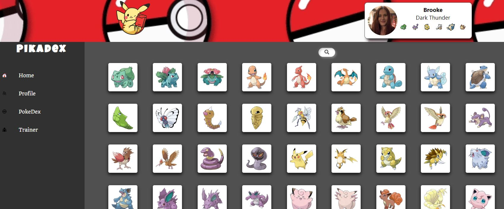

<p align="center">
  <a href="" rel="noopener">
 </a>
</p>

<h3 align="center">PikeDex</h3>

<div align="center">

[]()

</div>

---

<p align="center"> This was built as a full stack project using React, JavaScript, SpringBoot, Java and MySQL. Showing my ability to create a database an API that will be used by this user interface. 
    <br> 
</p>

## 📝 Table of Contents

- [About](#about)
- [Getting Started](#getting_started)
- [Deployment](#deployment)
- [Usage](#usage)
- [Built Using](#built_using)
- [TODO](../TODO.md)
- [Contributing](../CONTRIBUTING.md)
- [Authors](#authors)
- [Acknowledgments](#acknowledgement)

## 🧐 About <a name = "about"></a>

During my course with \_nology we learned how to use JavaScript, React, Java, Spring Boot and MySql. This final project was to show our ability to use all these skills. This repo shows the frontend, how the user can interact with the API and DB that was created.

PikaDex shows all the data being held by the DB, displaying each pokemon, where you can click on the image to get more information. You can also create a trainer, and store data within the database. Using the entire CRUD system of an API.

## 🏁 Getting Started <a name = "getting_started"></a>

To use this repo, you need to clone it down and use npm start in the terminal. This is still an on-going project so it isn't hosted on my GitHub Pages yet.

### Prerequisites

To run this repo you need to npm install in the terminal or when you cd into the file on GitBash.

```
npm install
```

## 🔧 Running the tests <a name = "tests"></a>

Jest is being used to do unit testing on this project, more tests need to be done as well as end to end testing. This will be downloaded when you have used npm install.

```
it("Selected NavBarItem has additional className", () => {
  const { container } = customRender(
    <NavBarItem imageSrc="" text="Dashboard" link="" selected="Dashboard" />
  );
  expect(container).toMatchSnapshot();
});
```

```
it("Should render an image on the profile header", async () => {
    render(<ProfileHeader />)

    const profileImage = screen.getByRole("img");

    expect(profileImage).toBeInTheDocument();
})
```

## 🎈 Usage <a name="usage"></a>

You can use this repo to create websites that use a API to create cards that can give a user more information when they click on a card. The user can also create profiles for things that will be saved in a database.

## 🚀 Deployment <a name = "deployment"></a>

This system will need to be deployed on a cloud or hosting site, as well as the API that it is using. 

## ⛏️ Built Using <a name = "built_using"></a>

- [React](https://reactjs.org/) - Web Framework
- [JavaScript](https://www.javascript.com/) - Code Language
- [PikaApi](*) - Api Database(Not hosted yet)

## ✍️ Authors <a name = "authors"></a>

- [@BrookeVerse](https://github.com/BrookeVerse) - Idea & Creation


## 🎉 Acknowledgements <a name = "acknowledgement"></a>

- _Nology coaches, who trained me on everything used in this project
